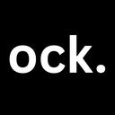

<div align="center">
  
  <h1>ock</h1>
  <p><strong>Your course. Your context. A teaching assistant that is always there.</strong></p>
  <p>A screen-aware study companion for macOS that understands what you are looking at,<br>grounds answers in your own materials, and explains ideas like a thoughtful TA.</p>
</div>

---

## Study without breaking your flow

Learning alone often means bouncing between notes, search results, lecture slides, and disconnected explanations. ock keeps that context together.

Create a project, add your course materials, and begin a study session. When something does not make sense, ask naturally. ock combines your question with the relevant material and what is currently visible on your screen, then responds with a clear, course-aware explanation.

## What it does

- **Sees the problem in front of you** — screen capture gives questions visual context, so phrases like “this equation” or “the diagram on the right” have meaning.
- **Learns from your materials** — PDFs are extracted, chunked, and searched for the most relevant course context.
- **Feels conversational** — type a question or use a push-to-talk workflow with Wispr Flow.
- **Explains out loud** — ElevenLabs turns responses into natural speech with playback controls.
- **Keeps sources close** — referenced materials can be surfaced beside the conversation for quick review.
- **Organizes study by project** — each course or topic gets its own materials and session context.

## The experience

```text
Question + screen + course materials
                 ↓
         contextual retrieval
                 ↓
        multimodal reasoning
                 ↓
     explanation + references + voice
```

ock is designed to prioritize understanding over simply producing an answer: calm explanations, useful steps, familiar notation, and enough context to help the idea stick.

## Built with

| Layer | Technology |
| --- | --- |
| Interface | SwiftUI for macOS |
| Reasoning and vision | Google Gemini |
| Course context | PDFKit extraction and local chunk retrieval |
| Voice input | Wispr Flow workflow with global Fn-key capture |
| Voice output | ElevenLabs text-to-speech |
| Screen awareness | ScreenCaptureKit and Core Graphics |

## Run locally

### Requirements

- macOS 26.1 or later
- A recent version of Xcode
- A Gemini API key
- An ElevenLabs API key for spoken responses
- Wispr Flow for the optional voice-input workflow

### Setup

1. Clone the repository and open the project:

   ```bash
   git clone https://github.com/IzaanQaiser/ock.git
   cd ock
   open ock.xcodeproj
   ```

2. In Xcode, open **Product → Scheme → Edit Scheme → Run → Arguments**.

3. Add these environment variables:

   ```text
   GEMINI_API_KEY
   ELEVEN_LABS_API_KEY
   ```

4. Build and run the `ock` scheme.

5. When prompted, grant **Screen Recording** permission. The global Fn-key workflow also requires **Accessibility** permission.

> [!IMPORTANT]
> Never place API keys in Swift files, committed configuration files, screenshots, issues, or pull requests. Use local environment variables and rotate any credential that may have been exposed.

## Project structure

```text
ock/
├── Models/       Projects, messages, and uploaded materials
├── Services/     Gemini, ElevenLabs, voice capture, and retrieval
├── Utilities/    Screen capture, PDF extraction, and window management
├── ViewModels/   Application, material, and study-session state
└── Views/        Projects, sessions, chat, resources, and overlays
```

## Current status

ock is an early-stage prototype built around the core study loop: bring your own materials, share the screen, ask naturally, and receive a grounded explanation. The architecture is intentionally local-first where practical, with external calls limited to the configured AI and voice services.

---

<div align="center">
  <sub>Built for the moments when office hours are over, but the learning is not.</sub>
</div>
